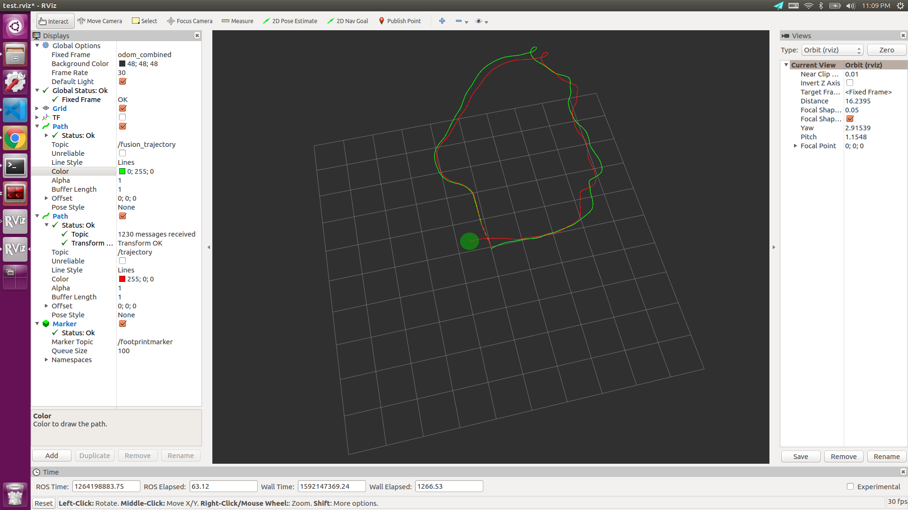

## Visualization

Green line represent fusion results. 
Red line represent raw odometry.
## Build 
> cd ~/catkin_ws/src  

> git clone https://github.com/fly-duck/robot_ekf_visualization.git

> cd ..

> catkin build 

## How to run 
> rosrun robot_pose_ekf visualation

> roslaunch robot_pose_ekf test_robot_pose_ekf.launch 
